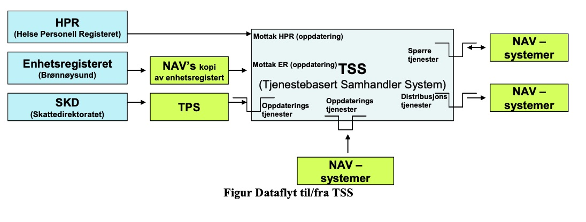

# Tssid
## Hva er ein tssid?
Tjenesteorientert Samhandler System (Inneholder adresser til alle samhandlere i NAV) ident
TSS er et fellesregister som inneholder opplysninger om de eksterne samarbeidspartnere som NAV utveksler informasjon med. 
Utviklet på grunn av behov for kvalitet i grunndata om helsepersonell, offentlige etater, institusjoner, kreditorer m.fl. Består av opplysninger fra Helsepersonellregisteret, Enhetsregisteret, TPS, HELFO og opplysninger som NAV har registrert.

### OBS Avdnr 1: 
Når det kommer en ny samhandler i TSS, får denne en egen avdeling med nr 01 og med egen TSS-ident. Denne avdelingen inneholder vanligvis ikke noen opplysninger, og hører ikke til noen bestemt praksissted. Men det er mulig å legge inn adresse på disse manuelt via f.eks. Infotrygd. Disse adressene blir ikke automatisk vedlikeholdt, men kan endres manuelt til f.eks. et annet legekontor. Dette kan da gi problemer fordi TSS-identen beholdes.

En samhandler er enten en person eller en organisasjon. F.eks leger, fysioterapauter og andre typer helsepersonell, NAV enheter, utenlandske pensjonskasser, trygdemyndigheter, ulike kreditorer som kemnerkontor, kommunekasser, inkassoselskaper, forsikringsselskaper, advokater, diverse offentlige etater og kommuner.

En samhandler er identifisert med samhandlertype (f.eks lege)  og en ident (f.eks fødselsnummer). Minimusopplysinger for en samhandler er ident, samhandlertype, navn og adresse.

TSS har ikke et eget brukergrensesnitt, men er et grunndataregister for andre fagsystmer i NAV. I tillegg er TSS også grunndataregister for flere fagsystemer for Helsedirektoratet som NAV drifter.

## Hvem oppretter tssid
TSS id består av opplysninger fra Helsepersonellregisteret, Enhetsregisteret, TPS, HELFO og opplysninger som NAV har registrert.
Nye tssid'r blir laget for hver ny praksis som lages, tssId vil ikke bli oppdatert. 
Så det er en "evig" unik id for hver samhandlerprakis.

## Hvordan benyttes ein tssid?
Ein tssid benyttes eks i [syfosmmottak](https://github.com/navikt/syfosmmottak) får å opprette ein elektronisk abomment, for den akutelle tssid.
Dette skjer ved at ein lege sender inn ein sykmelding, legeerklæring, dialogmelding, der gjørers det eit oppslag i [smtss](https://github.com/navikt/smtss).
og får da evt finne best  tssid som match.

## Hvilken systemer bruker tssid
* Arena
* Infotrygd
* Emottak
* SyfosmInfotrygd
* SyfosmArena
* SyfosmMottak
* Smtss

## Flyt for tss oppdatering

